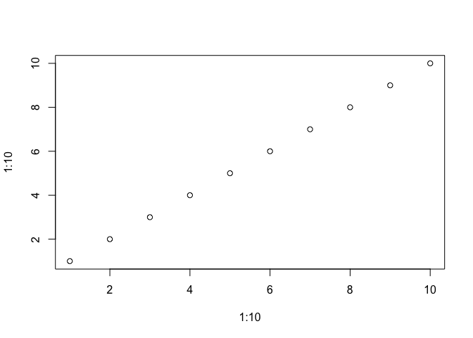

reg2gene
================
Inga Patarcic, Altuna Akalin

This repo contains the code for predicting the target genes for regulatory elements

Ideally it should contain the following:

-   regulatory activity quantification per pre-defined region (regulatoryActivity)
    -   the code base that is used to quantify enhancer activties across different markers and studies
    -   The scripts to match enhancers to potential target genes within pre-defined window around gene TSSes
-   enhancer target prediction (targetPrediction)
    -   This should contain the code for target prediction methods
-   performance metrics (performance):
    -   should contain the code for performance metrics.

``` r
plot(1:10,1:10)
```


